# Лабораторная работа №1: Расширенные возможности ветвления в Git

## Цель работы

Освоить расширенные возможности ветвления в системе контроля версий Git с помощью интерактивной песочницы Learn Git Branching. Работа включает выполнение заданий различной сложности, направленных на глубокое понимание механизмов создания веток, переключения между ними, слияния и других операций.

## Описание

Эта лабораторная работа направлена на практическое освоение продвинутых концепций ветвления в Git через интерактивную песочницу [Learn Git Branching](https://learngitbranching.js.org/?locale=ru_RU). Мы будем использовать Mermaid только для визуализации сценариев ветвления, чтобы лучше понимать, что происходит в репозитории. Все задания выполняются в браузере без необходимости установки дополнительного программного обеспечения.

## Требования

- Современный веб-браузер (Chrome, Firefox, Safari, Edge)
- Доступ к интернету
- Базовые знания Git

## Подготовка к работе

1. Откройте в браузере интерактивную песочницу: [https://learngitbranching.js.org/?locale=ru_RU](https://learngitbranching.js.org/?locale=ru_RU)
2. Ознакомьтесь с интерфейсом:
   - Левая панель - командная строка Git
   - Правая панель - визуализация репозитория в виде графа
   - Нижняя панель - вывод команд

## Теоретическая справка

### Что такое ветвление в Git?

Ветвление в Git - это мощный механизм, позволяющий разрабатывать функциональность изолированно от основной кодовой базы. Каждая ветка представляет собой независимую линию разработки, которая может содержать свои собственные коммиты.

### Основные команды для работы с ветками

- `git branch <имя_ветки>` - создание новой ветки
- `git checkout <имя_ветки>` - переключение на существующую ветку
- `git checkout -b <имя_ветки>` - создание новой ветки и переключение на неё
- `git merge <имя_ветки>` - слияние указанной ветки с текущей
- `git rebase <имя_ветки>` - перебазирование текущей ветки на указанную

## Задания

### Задание 1: Создание ветки и различные типы коммитов

**Цель:** Научиться создавать ветки и делать различные типы коммитов.

**Описание:** В этом задании мы создадим новую ветку `feature` и сделаем в ней несколько коммитов. Мы также рассмотрим различные типы коммитов, которые можно визуализировать в Mermaid.

Когда мы создаем ветку в Git, мы фактически создаем новый указатель на тот же коммит, на котором мы сейчас находимся. Это позволяет нам разрабатывать функциональность параллельно с основной веткой, не влияя на неё.

**Граф репозитория до выполнения:**
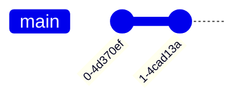

**Процесс выполнения:**
1. Создайте новую ветку с названием `feature`
2. Переключитесь на эту ветку
3. Сделайте три коммита разных типов

**Граф репозитория после выполнения:**
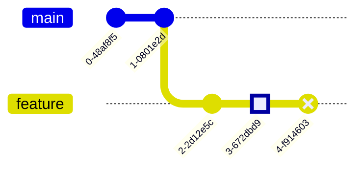

**Команды для выполнения:**
```bash
git branch feature
git checkout feature
# Сделайте обычный коммит (в песочнице просто git commit)
git commit
# Сделайте еще два коммита
git commit
git commit
```

### Задание 2: Работа с тегами

**Цель:** Научиться добавлять теги к коммитам.

**Описание:** Теги в Git используются для пометки важных моментов в истории проекта, таких как релизы. В этом задании мы создадим ветку `release` и добавим к коммитам теги версий.

Теги в Git бывают двух типов: легковесные и аннотированные. Легковесные теги представляют собой просто указатель на определенный коммит, тогда как аннотированные теги хранят дополнительную информацию (имя автора, email, дату и сообщение).

**Граф репозитория до выполнения:**
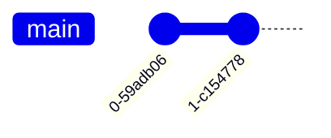

**Процесс выполнения:**
1. Создайте новую ветку `release`
2. Переключитесь на эту ветку
3. Сделайте коммит и добавьте к нему тег `v1.0.0`
4. Сделайте еще один коммит и добавьте тег `v1.0.1`
5. Сделайте третий коммит и добавьте тег `v1.1.0`

**Граф репозитория после выполнения:**
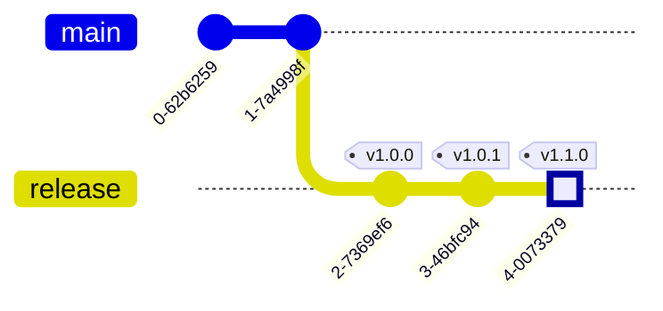

**Команды для выполнения:**
```bash
git branch release
git checkout release
git commit
git tag v1.0.0
git commit
git tag v1.0.1
git commit
git tag v1.1.0
```

### Задание 3: Слияние с пользовательскими параметрами

**Цель:** Научиться настраивать параметры слияния.

**Описание:** При слиянии веток Git создает специальный коммит слияния, который имеет двух родителей. В этом задании мы объединим ветку `feature` в `main` и рассмотрим, как можно настроить параметры коммита слияния.

Fast-forward слияние - это когда Git просто перемещает указатель текущей ветки вперед, если история не разошлась. Это происходит, когда в целевой ветке не было новых коммитов с момента создания исходной ветки.

**Граф репозитория до выполнения:**
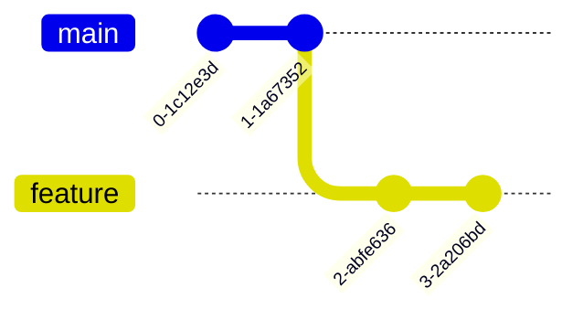

**Процесс выполнения:**
1. Переключитесь на ветку `main`
2. Объедините изменения из ветки `feature`
3. Сделайте еще один коммит в `main`

**Граф репозитория после выполнения:**
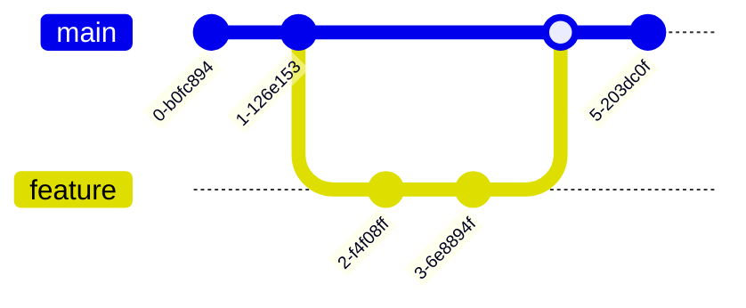

**Команды для выполнения:**
```bash
git checkout main
git merge feature
git commit
```

### Задание 4: Работа с относительными ссылками

**Цель:** Научиться использовать относительные ссылки для навигации по истории коммитов.

**Описание:** В Git можно использовать относительные ссылки для обращения к коммитам относительно определенной позиции. Это особенно полезно при работе с длинной историей коммитов.

Относительные ссылки позволяют:
- `HEAD~n` - ссылка на n коммитов назад от HEAD
- `HEAD^` или `HEAD^1` - первый родитель HEAD
- `HEAD^2` - второй родитель HEAD (в случае коммита слияния)

**Граф репозитория до выполнения:**
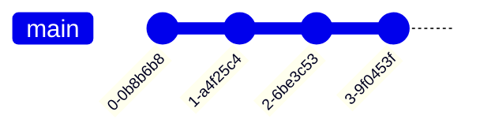

**Процесс выполнения:**
1. Переключитесь на коммит, который находится на два шага назад от `HEAD`
2. Создайте там новую ветку `relative-test`
3. Переключитесь на `relative-test` и сделайте коммит
4. Переключитесь на `main` и сделайте коммит
5. Используйте относительные ссылки для переключения на различные коммиты

**Граф репозитория после выполнения:**
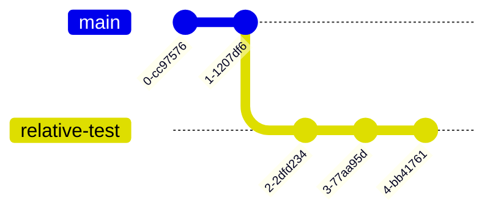

**Команды для выполнения:**
```bash
git checkout HEAD~2
git branch relative-test
git checkout relative-test
git commit
git checkout main
git commit
# Попробуйте переключаться между коммитами с помощью относительных ссылок
git checkout HEAD~
git checkout HEAD~3
```

### Задание 5: Использование reset и revert

**Цель:** Научиться отменять изменения с помощью reset и revert.

**Описание:** В Git есть два основных способа отмены изменений:
- `git reset` - перемещает указатель ветки на другой коммит, потенциально теряя изменения
- `git revert` - создает новый коммит, который отменяет изменения указанного коммита

Reset имеет три режима:
- `--soft` - перемещает указатель ветки, но оставляет изменения в индексе и рабочей директории
- `--mixed` (по умолчанию) - перемещает указатель ветки и обновляет индекс, но оставляет изменения в рабочей директории
- `--hard` - перемещает указатель ветки и полностью отменяет все изменения

**Граф репозитория до выполнения:**


**Процесс выполнения:**
1. Сделайте несколько коммитов
2. Используйте `git reset` для перемещения указателя ветки назад
3. Используйте `git revert` для отмены изменений последнего коммита

**Граф репозитория после выполнения:**
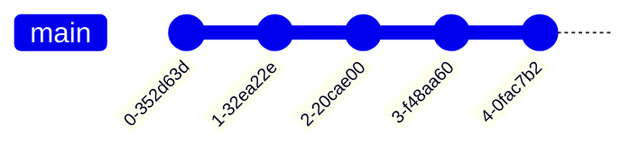

**Команды для выполнения:**
```bash
# Сделайте несколько коммитов
git commit
git commit
# Используйте reset для перемещения указателя назад
git reset HEAD~
# Сделайте еще коммит
git commit
# Используйте revert для отмены последнего коммита
git revert HEAD
```

### Задание 6: Стратегии слияния

**Цель:** Понять разницу между различными стратегиями слияния.

**Описание:** Git предоставляет несколько стратегий слияния:
- `merge` - создает коммит слияния
- `rebase` - перебазирует ветку на целевую
- `squash` - объединяет все коммиты ветки в один при слиянии

Выбор стратегии зависит от контекста: для долгоживущих веток лучше подходит merge, для короткоживущих feature-веток - squash или rebase.

**Граф репозитория до выполнения:**
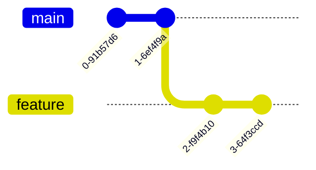

**Процесс выполнения:**
1. Переключитесь на `feature` и перебазируйте её на `main`
2. Переключитесь на `main` и объедините `feature` с опцией squash

**Граф репозитория после выполнения:**


**Команды для выполнения:**
```bash
git checkout feature
git rebase main
git checkout main
git merge --squash feature
git commit
```

### Задание 7: Сложное ветвление с множеством веток

**Цель:** Научиться управлять сложными сценариями ветвления.

**Описание:** В реальных проектах часто возникают ситуации, когда существует множество параллельных веток разработки. В этом задании мы создадим сложную структуру веток и рассмотрим, как они могут взаимодействовать между собой.

Важно понимать, что каждая ветка в Git - это просто легковесный указатель на коммит. Это делает создание и удаление веток очень быстрыми операциями.

**Граф репозитория до выполнения:**


**Процесс выполнения:**
1. Создайте ветку `hotfix` и сделайте в ней коммит
2. Создайте ветку `develop` и сделайте в ней коммит с тегом `v2.0.0`
3. Создайте ветку `feature` из `develop` и сделайте коммит
4. Переключитесь на `main` и затем на `hotfix`, сделайте обычный коммит
5. Переключитесь на `develop` и сделайте коммит
6. Переключитесь на `feature` и сделайте обычный коммит
7. Переключитесь на `main` и объедините `hotfix`
8. Переключитесь на `feature` и сделайте коммит
9. Переключитесь на `develop` и создайте ветку `experimental`
10. Сделайте коммит в `experimental`
11. Переключитесь на `develop` и объедините `hotfix`
12. Переключитесь на `experimental` и сделайте коммит

**Граф репозитория после выполнения:**
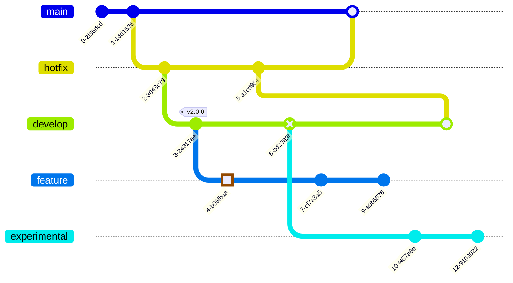

**Команды для выполнения:**
```bash
git branch hotfix
git checkout hotfix
git commit
git branch develop
git checkout develop
git commit
git tag v2.0.0
git branch feature
git checkout feature
git commit
git checkout main
git checkout hotfix
git commit
git checkout develop
git commit
git checkout feature
git commit
git checkout main
git merge hotfix
git checkout feature
git commit
git checkout develop
git branch experimental
git checkout experimental
git commit
git checkout develop
git merge hotfix
git checkout experimental
git commit
```

## Самостоятельные задания

Попробуйте самостоятельно реализовать следующие сценарии ветвления в песочнице Learn Git Branching. Для каждого задания предоставлен только граф репозитория, который должен получиться в результате. Ваша задача - определить последовательность команд Git, необходимых для достижения этого состояния.

### Самостоятельное задание 1

**Описание:** Feature branch с merge request

Создайте feature branch, добавьте в него несколько коммитов, затем объедините ветку через merge request (симулируя создание MR/PR в реальных системах контроля версий).

**Целевой граф репозитория:**
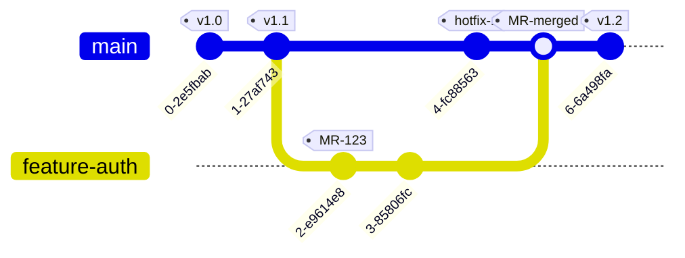

### Самостоятельное задание 2

**Описание:** Hotfix с merge request

Создайте hotfix ветку для срочного исправления, затем объедините ветку через merge request.

**Целевой граф репозитория:**
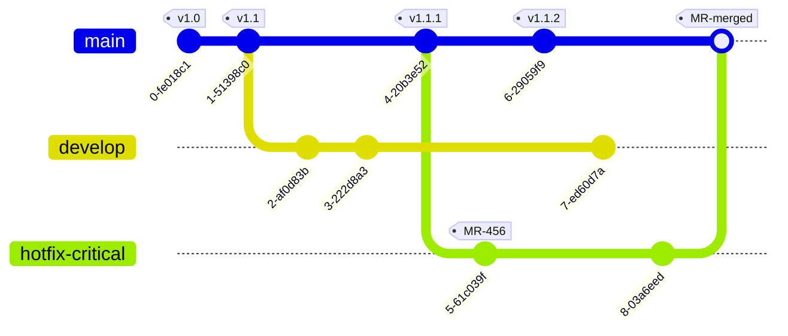

### Самостоятельное задание 3

**Описание:** Release branch с merge request

Создайте release branch, добавьте в него несколько коммитов, затем объедините ветку через merge request.

**Целевой граф репозитория:**
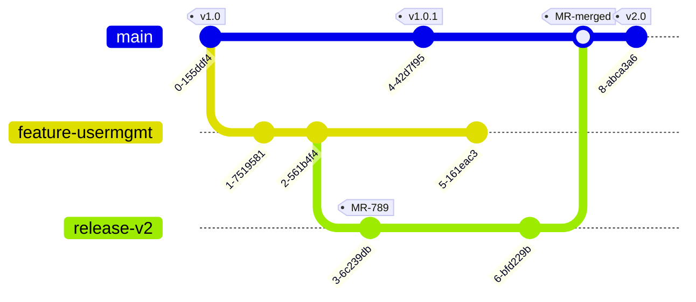

### Самостоятельное задание 4

**Описание:** Complex feature с merge request

Создайте сложную структуру feature веток с несколькими подветками, затем объедините все через merge request.

**Целевой граф репозитория:**
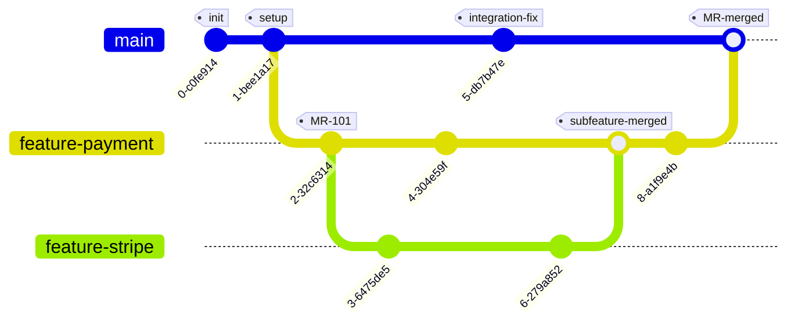

### Самостоятельное задание 5

**Описание:** Multiple features с merge request

Создайте несколько параллельных feature веток, затем объедините все через merge request.

**Целевой граф репозитория:**
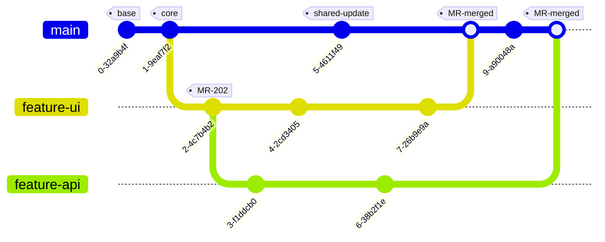

## Отчетность

В отчете по лабораторной работе должны быть представлены:

1. Скриншоты выполненных заданий из песочницы
2. Краткое описание каждого выполненного задания с объяснением, что происходит на каждом этапе
3. Mermaid диаграммы для каждого задания
4. Возможные трудности, возникшие при выполнении заданий
5. Выводы по работе

## Контрольные вопросы

1. Что такое ветвление в Git и зачем оно нужно?
2. В чем разница между `git merge` и `git rebase`?
3. Что такое `HEAD` в Git?
4. Как использовать относительные ссылки в Git?
5. В чем преимущество использования веток в Git?
6. В чем разница между `git reset` и `git revert`?
7. Какие стратегии слияния вы знаете?
8. Как использовать относительные ссылки для навигации по истории коммитов?
9. В чем разница между fast-forward и обычным слиянием?
10. Как создать новую ветку и переключиться на неё одной командой?

## Дополнительные материалы

- [Официальная документация Git](https://git-scm.com/doc)
- [Git Book на русском языке](https://git-scm.com/book/ru/v2)
- [Learn Git Branching](https://learngitbranching.js.org/?locale=ru_RU)